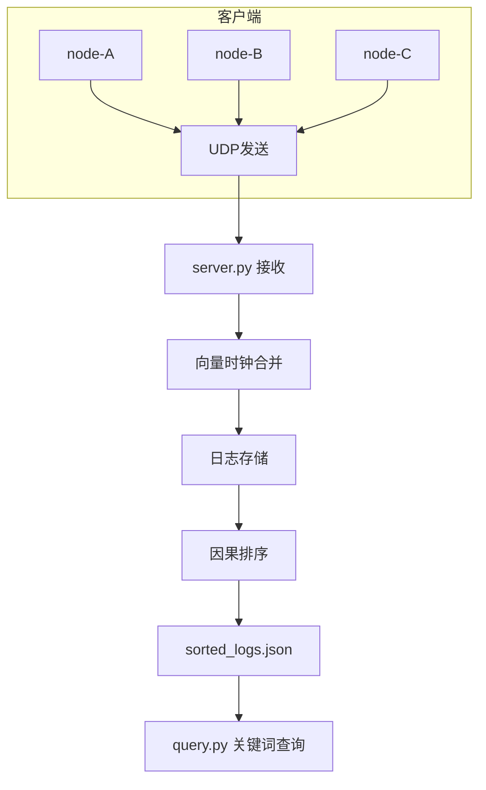
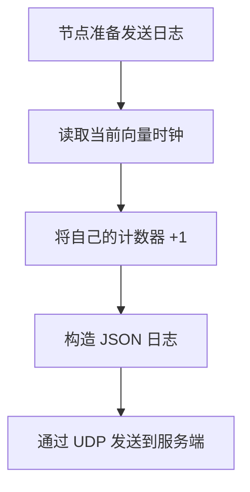
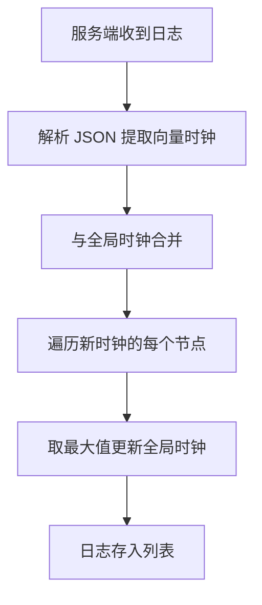
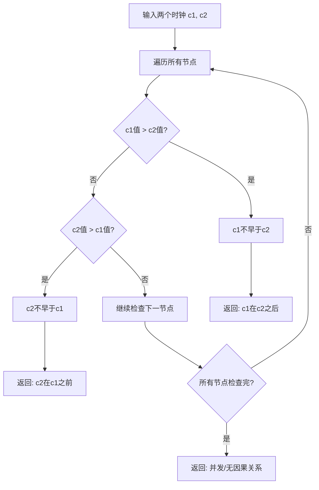

# 基于向量时钟的分布式日志聚合系统

## 系统架构图



## 向量时钟算法流程

### 节点发送日志流程



### 服务端接收合并流程



### 因果比较逻辑



## 日志格式 Schema

```json
{
  "node_id": "string",
  "vector_clock": {"node_id": "integer"},
  "timestamp": "float",
  "level": "INFO|WARN|ERROR",
  "message": "string"
}
```

## 运行演示

```bash
# 启动服务端
python server.py

# 启动3个节点（各开一个终端）
python client.py node-A
python client.py node-B
python client.py node-C

# 运行10秒后按 Ctrl+C 停止

# 查询日志
python query.py INFO
python query.py node-A
```

## 项目文件说明

| 文件 | 功能 |
|------|------|
| `vector_clock.py` | 向量时钟核心算法 |
| `client.py` | 日志采集 Agent |
| `server.py` | 聚合 Server |
| `sorter.py` | 因果排序器 |
| `query.py` | 关键词查询工具 |
| `test_vector_clock.py` | 单元测试 |

## 技术栈

- **语言**: Python 3.14
- **网络**: UDP Socket
- **存储**: JSON 文件
- **辅助库**: rich (彩色终端输出)

## 作者

1824-git
